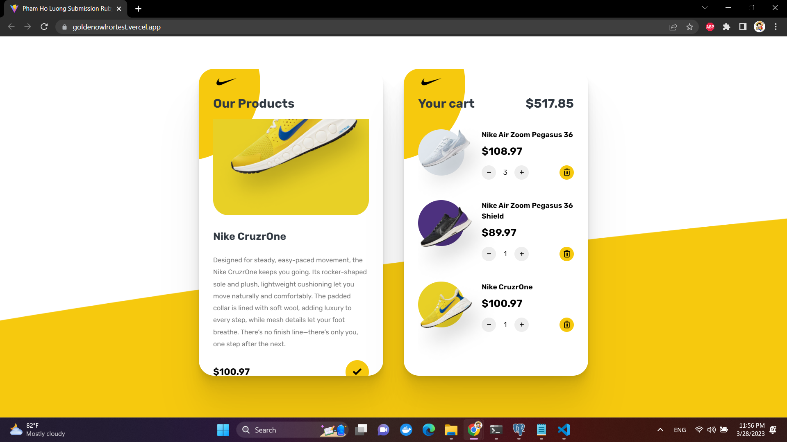

# README
# G-Sneaker
This is my Submission for web developer intern assignment at [Golden Owl](https://goldenowl.asia)

Link deploy front-end: https://goldenowlrortest.vercel.app

Link deploy back-end: https://goldenowlrortest.onrender.com/api/v1/shoes

(Because Heroku is no longer free, I deploy front-end to [Vercel](https://vercel.com) and back-end to [Render](https://render.com/))

[My Live Demo](https://goldenowlrortest.vercel.app)
# Guild to run project on local:
Make sure that you have installed ruby, rails, node and postgresql
- Clone this repository using 
`git clone https://github.com/luongphamho/goldenowlrortest.git`

- Change .env file [./front-end/.env](./front-end/.env) to back-end local URL [default: `http://localhost:3000/api/v1/shoes`]

- Change [this section to your local PostgreSQL database config](https://github.com/luongphamho/goldenowlrortest/blob/main/config/database.yml#L24) and **!IMPORTANT** comment [this line](https://github.com/luongphamho/goldenowlrortest/blob/main/config/puma.rb#L33) it needs for deployment but on local it will make error when run.

- Run `gem install bundler` and `bundle install` to install gem.

- Insert data to PostgreSQL database with file [scriptInsertSQL.sql](https://github.com/luongphamho/goldenowlrortest/blob/main/scriptInsertSQL.sql)

- Run `cd front-end` and `run yarn` or `npm install` to install package in front-end side

- Run `yarn dev` from front-end path to start front-end.
# Technical stack:
### Back-end:
- Ruby on rails, Rack-cors for CORS
- [Deploy to Render](https://goldenowlrortest.onrender.com/api/v1/shoes)
### Front-end:
- ReactJs, Redux toolkit (thunk) for State management, Vite
- [Deploy to vercel](https://goldenowlrortest.vercel.app)
### Database:
- PostgreSQL (Remote database in render)